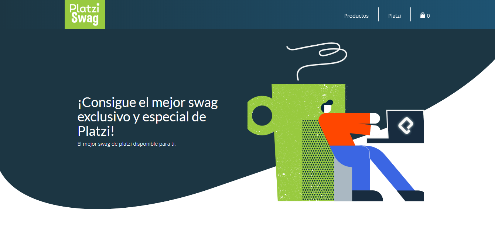

## Ecommerce App

Practic projec in Gatsby.js Platzi course

## How to use?

Require Node.JS

- `npm intall` to install node dependencies
- `npm run develop` to run development project
- `npm run build` to create the production project

## URL

- `https://platzi-ecommerce-santiago-prieto.netlify.com/`
